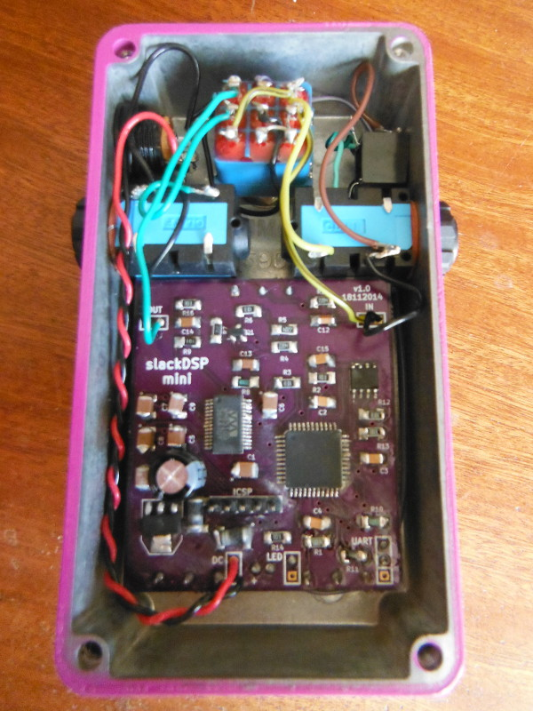

# slackDSP_mini

Nothing to see here yet....

 

### Resources
*[dsPIC33FJ128GP804 datasheet] (http://ww1.microchip.com/downloads/en/DeviceDoc/70292G.pdf).
*[Wolfson WM8510 datasheet] (https://www.cirrus.com/en/pubs/proDatasheet/WM8510_v4.5.pdf).
*[23LC1024 datasheet] (http://ww1.microchip.com/downloads/en/DeviceDoc/20005142C.pdf).
*[MPLABX IDE download page] (http://www.microchip.com/pagehandler/en-us/family/mplabx/home.html).
*[XC16 compiler download page] (http://www.microchip.com/pagehandler/en-us/devtools/mplabxc/home.html).
